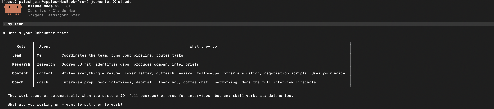
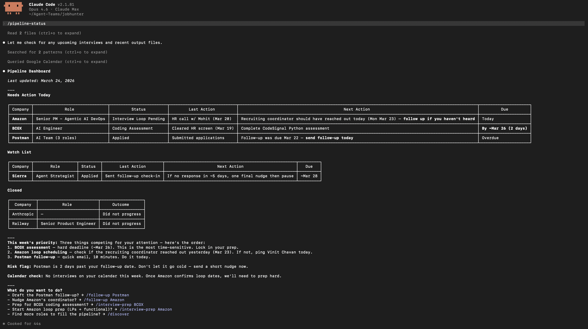

# Jobhunter | Your entire recruiting lifecycle — from discovery to signed offer.

<!-- badges -->
[](https://github.com/palashjain95/jobhunter/blob/main/LICENSE) [](https://github.com/palashjain95/jobhunter/issues) [](https://linkedin.com/in/palash-jain-2565b612a/)

Your AI recruiting team — a researcher, a writer, and a coach working your job search end-to-end.

Jobhunter lets you:

- **Search across job boards** → matching roles from Indeed, LinkedIn, Glassdoor
- **Tailor your application** → fit score, resume, cover letter, outreach
- **Prep for any interview** → company brief, question bank, mock practice
- **Evaluate and negotiate offers** → comp breakdown, market comparison, scripts

Three AI agents. Thirteen skills. Your entire recruiting lifecycle — from discovery to signed offer.

Built for [Claude Code](https://code.claude.com) and [Cowork](https://claude.com/cowork).

---

## What It Does

Tell it what you need. The team handles the rest.


| You say                          | What happens                                                                                            |
| -------------------------------- | ------------------------------------------------------------------------------------------------------- |
| "Here's a job I'm interested in" | Scores your fit, tailors your resume, writes your cover letter, preps interview questions — one package |
| "Find me roles"                  | Searches Indeed, LinkedIn, Glassdoor, and company career pages for matches                              |
| "I have an interview at Google"  | Company intel brief + likely questions with STAR stories + mock practice                                |
| "I just finished my interview"   | Debriefs your performance honestly, drafts a personalized thank-you                                     |
| "I got an offer — is it good?"   | Comp breakdown vs market data, negotiation strategy with scripts                                        |
| "What should I be doing?"        | Pipeline dashboard showing every application, what's next, what's urgent                                |


No memorizing commands. Just describe your situation.

---

## Get Started

### Install

**Cowork (easiest):** Add via the plugin manager — works with local folders or GitHub sync.

**Claude Code CLI:**

```bash
# From marketplace
claude plugin marketplace add palashjain95/palash-jain-plugins
claude plugin install jobhunter@palash-jain-plugins

# Or directly
claude plugin install github:palashjain95/jobhunter
```

Or clone and run locally:

```bash
git clone https://github.com/palashjain95/jobhunter.git
cd jobhunter
claude --plugin-dir .
```

### Personalize (5 minutes)

```
/personalize
```

Drop your resume, answer a few questions about your background and goals, and the team learns who you are. This creates your knowledge base — profile, STAR stories, writing style, negotiation preferences. Everything stays on your machine.

Quick mode takes 5 minutes. Full mode takes 20 and captures more nuance. You can update any section anytime.

---

## Your Team

Three agents. Each owns a lane.

```
+--------------------------+  +--------------------------+  +--------------------------+
|     THE RESEARCHER       |  |       THE WRITER         |  |       THE COACH          |
|     --------------       |  |      ----------          |  |      ---------           |
|                          |  |                          |  |                          |
|  /discover               |  |  /write-application      |  |  /interview-prep         |
|  Find matching roles     |  |  Cover letter, outreach, |  |  Questions + STAR        |
|         |                |  |  essays                  |  |  stories mapped          |
|         v                |  |         |                |  |         |                |
|  /fit-analysis           |  |         v                |  |         v                |
|  Score fit (0-100),      |  |  /follow-up              |  |  /mock-interview         |
|  optimize for ATS        |  |  Nudge stalled apps,     |  |  Practice with           |
|         |                |  |  handle rejections       |  |  real-time feedback      |
|         v                |  |         |                |  |         |                |
|  /company-research       |  |         v                |  |         v                |
|  Intel brief, recent     |  |  /offer-analysis         |  |  /interview-debrief      |
|  news, culture signals   |  |  Comp vs market,         |  |  Performance analysis    |
|                          |  |  compare offers          |  |  + thank-you email       |
|                          |  |         |                |  |         |                |
|                          |  |         v                |  |         v                |
|                          |  |  /negotiate              |  |  /coffee-chat            |
|                          |  |  Counter-offer +         |  |  Networking prep,        |
|                          |  |  scripts                 |  |  elevator pitch          |
|                          |  |                          |  |                          |
|                          |  |  All in YOUR voice       |  |  Full interview          |
|                          |  |                          |  |  lifecycle               |
+------------+-------------+  +------------+-------------+  +------------+-------------+
             |                             |                             |
             +-----------------------------+-----------------------------+
                                           |
                                           v
                              +------------------------+
                              |   /pipeline-status     |
                              |   Track everything     |
                              +------------------------+
```

---

## Interview Frameworks

The coach auto-loads the right framework based on your target:

```
COMPANIES                           CAREER PATHS
─────────                           ────────────
Amazon    → Leadership Principles   MBB         → PEI + Case Interview
Google    → Googliness              PE          → Deal Discussion + LBO
Meta      → Product Execution       Finance     → Valuation + Modeling
Apple     → Design Taste            Marketplace → Uber/DoorDash Style
Microsoft → Growth Mindset          Startups    → Founder Mindset
Netflix   → Keeper Test             General     → Behavioral Fallback
```

Add your own frameworks in `.claude/resources/`.

---

## Works Alone, Better Connected

Everything works out of the box. Connect your tools for an even better experience.


| What you do              | Without connections        | With connections                                                     |
| ------------------------ | -------------------------- | -------------------------------------------------------------------- |
| Find roles               | Web search                 | Searches Indeed + LinkedIn + Glassdoor + ZipRecruiter simultaneously |
| Send thank-yous          | Copy-paste the text        | Creates a draft in Gmail/Outlook — you review before sending         |
| Check interview schedule | You tell it                | Auto-detects upcoming interviews from your calendar                  |
| Debrief after interview  | You describe what happened | Auto-pulls the transcript and analyzes specific moments              |


See [CONNECTORS.md](CONNECTORS.md) for setup.

---

## Use It On the Go

Start a task on your laptop, check progress from your phone. Claude Code's [Remote Control](https://code.claude.com/docs/en/remote-control) lets you connect any session to the Claude web or mobile app.

```
/remote
```

Scan the QR code or open the URL on another device. Your full session — agents, knowledge base, MCP servers — stays running locally. You just get a window into it from anywhere.

**Example:** Paste a JD at your desk, kick off the full package, run `/remote`, walk to class. Check your phone — fit analysis is done, cover letter is ready, interview prep is building. Type "mock interview me" from your phone. The coach runs on your laptop, the conversation happens in your hand.

---

## Your Data Stays Yours

- Your resume, stories, and preferences live in `knowledge/` — local only, never uploaded
- Materials created for each company live in `output/` — local only
- Your application tracker lives in `pipeline-data.md` — local only
- A safety hook prevents any agent from modifying your personal data during runs

The plugin ships the team's intelligence. Your personal content stays on your machine.

---

## Requirements

- **[Claude Code](https://code.claude.com)** or **[Cowork](https://claude.com/cowork)**
- For multi-agent coordination: `CLAUDE_CODE_EXPERIMENTAL_AGENT_TEAMS=1` (optional — every skill works without it)
- All tool connections are optional

---

## Examples

### Your Team


### Pipeline Status
